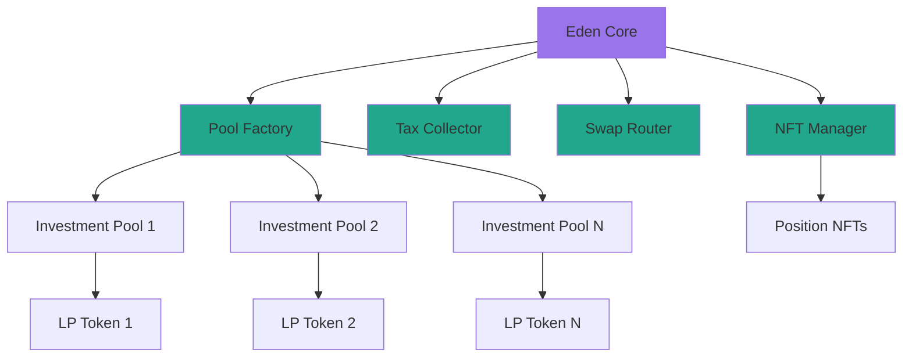

# Eden Vest Protocol

[](https://opensource.org/licenses/MIT)


[](https://book.getfoundry.sh/)

## 🌍 Overview

Eden Vest is a next-generation decentralized investment protocol that bridges traditional finance with DeFi, enabling organizations, governments, and corporations to create tokenized investment pools on-chain. Built on AssetChain, Eden Vest revolutionizes how real-world assets and investment opportunities are accessed globally.

### 🎯 Key Features

- **🏊 Multi-Pool Architecture**: Create unlimited investment pools for different asset classes
- **🪙 LP Token System**: Receive tradeable LP tokens representing your pool shares
- **🎨 Dynamic NFT Positions**: Beautiful, animated NFTs visualizing your investments
- **💱 Multi-Token Support**: Invest with any token via integrated DEX swaps
- **🏛️ Institutional Grade**: Designed for governments, corporations, and financial institutions
- **🔐 Multisig Security**: Pool-specific multisig wallets for fund management
- **📊 Tax Management**: Automated tax collection and distribution system
- **🔄 Upgradeable**: UUPS proxy pattern for seamless protocol evolution

## 🏗️ Architecture



### Core Contracts

| Contract | Description | Key Functions |
|----------|-------------|---------------|
| **EdenCore** | Main protocol entry point | `createPool()`, `invest()`, `withdraw()` |
| **PoolFactory** | Deploys investment pools efficiently | `createPool()` |
| **LPToken** | ERC20 pool share tokens | `mint()`, `burn()` |
| **TaxCollector** | Tax management system | `collectTax()`, `withdrawTax()` |
| **SwapRouter** | DEX integration | `swapExactTokensForTokens()` |
| **NFTPositionManager** | NFT position tracking | `mintPosition()`, `burnPosition()` |
| **AdminInterface** | Protocol administration | `createPool()`, `updatePoolConfig()` |

## 🚀 Getting Started

### Prerequisites

- [Foundry](https://book.getfoundry.sh/getting-started/installation) - Smart contract development framework
- [Git](https://git-scm.com/) - Version control
- [Node.js](https://nodejs.org/) v18+ - For additional tooling

### Installation

```bash
# Clone the repository
git clone https://github.com/eden-finance/eden-vest.git
cd eden-vest

# Install dependencies
forge install

# Build contracts
forge build

# Run tests
forge test -vvv --gas-limit 60000000
```

### Environment Setup

Create a `.env` file:

```env
# Network Configuration
ASSETCHAIN_RPC=https://rpc.assetchain.org
TESTNET_RPC=https://testnet-rpc.assetchain.org
PRIVATE_KEY=your_deployment_key

# Contract Configuration
ADMIN_ADDRESS=0x...
TREASURY_ADDRESS=0x...
CNGN_ADDRESS=0x...
GLOBAL_TAX_RATE=250  # 2.5% in basis points

# First Pool Configuration
POOL_NAME="Nigerian Money Market"
POOL_SYMBOL="NMM"
POOL_MULTISIG=0x...
LOCK_DURATION=2592000  # 30 days in seconds
MIN_INVESTMENT=1000000000000000000000  # 1000 cNGN
MAX_INVESTMENT=10000000000000000000000000  # 10M cNGN
EXPECTED_RATE=1500  # 15% APY

# DEX Configuration (if available)
UNISWAP_ROUTER=0x...
UNISWAP_QUOTER=0x...

# Verification
ETHERSCAN_API_KEY=your_api_key
```

## 📊 Usage Examples

### For Investors

#### Direct Investment with cNGN

```solidity
// Approve cNGN spending
IERC20(cNGN).approve(edenCore, investmentAmount);

// Invest in a specific pool
(uint256 nftId, uint256 lpTokens) = edenCore.invest(
    poolAddress,
    investmentAmount,
    "My Q1 2024 Investment"
);
```

#### Investment with Token Swap

```solidity
// Approve any token
IERC20(USDT).approve(edenCore, usdtAmount);

// Invest with automatic swap to cNGN
EdenCore.InvestmentParams memory params = EdenCore.InvestmentParams({
    pool: poolAddress,
    tokenIn: USDT,
    amountIn: usdtAmount,
    minAmountOut: minCNGN,
    deadline: block.timestamp + 300,
    title: "USDT Investment"
});

(uint256 nftId, uint256 lpTokens) = edenCore.investWithSwap(params);
```

#### Using LP Tokens as Collateral ( Eden Lend )

```solidity
// Approve LP tokens for Eden Lending Protocol
IERC20(lpToken).approve(edenLending, lpAmount);

// Borrow against LP tokens
edenLending.borrow(lpToken, lpAmount, borrowAmount);
```

#### Withdrawing Investment

```solidity
// Return LP tokens and withdraw
IERC20(lpToken).approve(poolAddress, lpAmount);
edenCore.withdraw(poolAddress, nftId, lpAmount);
```

### For Pool Administrators

#### Creating a New Pool

```solidity
IPoolFactory.PoolParams memory params = IPoolFactory.PoolParams({
    name: "Government Infrastructure Fund",
    symbol: "GIF",
    admin: adminAddress,
    cNGN: cNGNAddress,
    poolMultisig: multisigAddress,
    multisigSigners: [signer1, signer2, signer3],
    lockDuration: 90 days,
    minInvestment: 5000e18,
    maxInvestment: 50_000_000e18,
    utilizationCap: 1_000_000_000e18,
    expectedRate: 2000, // 20% APY
    taxRate: 0 // Use global rate
});

address newPool = adminInterface.createPool(params);
```

#### Managing Pool Configuration

```solidity
IInvestmentPool.PoolConfig memory config = IInvestmentPool.PoolConfig({
    name: "Updated Pool Name",
    lockDuration: 60 days,
    minInvestment: 2000e18,
    maxInvestment: 100_000_000e18,
    utilizationCap: 2_000_000_000e18,
    expectedRate: 1800,
    taxRate: 300, // 3% pool-specific tax
    acceptingDeposits: true
});

adminInterface.updatePoolConfig(poolAddress, config);
```

### For Multisig Operations


## 🛡️ Security Features

### Multi-Layer Security

1. **Role-Based Access Control**
   - `ADMIN_ROLE`: Protocol governance
   - `POOL_CREATOR_ROLE`: Pool deployment
   - `POOL_ADMIN_ROLE`: Pool-specific management
   - `MULTISIG_ROLE`: Fund operations
   - `EMERGENCY_ROLE`: Circuit breaker

2. **Security Mechanisms**
   - ReentrancyGuard on all external calls
   - Pausable functionality for emergencies
   - Input validation and overflow protection
   - Slippage protection on swaps
   - Non-transferable position NFTs

3. **Multisig Requirements**
   - Minimum 2 signers per pool
   - Separate multisigs for pools and protocol treasury
   - Time-locked operations for critical functions

### Audit Status

🔍 **Security Audits**
- [ ] Internal Security Review

## 📈 Pool Examples

### Government Bonds
```solidity
- Name: "Nigerian Treasury Bills"
- Duration: 91 days
- Expected Return: 15% APY
- Min Investment: 10,000 cNGN
- Max Investment: 100M cNGN
```

### Corporate Investment
```solidity
- Name: "Dangote Cement Expansion"
- Duration: 180 days
- Expected Return: 25% APY
- Min Investment: 50,000 cNGN
- Max Investment: 500M cNGN
```

### Real Estate Fund
```solidity
- Name: "Lagos Property Development"
- Duration: 365 days
- Expected Return: 30% APY
- Min Investment: 100,000 cNGN
- Max Investment: 1B cNGN
```

## 🧪 Testing

### Run Test Suite

```bash
# Run all tests
forge test

# Run with gas reporting
forge test --gas-report

# Run specific test file
forge test --match-contract EdenCoreTest

# Run with verbosity
forge test -vvvv

# Generate coverage report
forge coverage --report lcov
```

### Test Categories

- **Unit Tests**: Individual contract functions
- **Integration Tests**: Cross-contract interactions
- **Fuzz Tests**: Property-based testing
- **Invariant Tests**: Protocol invariants
- **Fork Tests**: Mainnet fork testing

## 🚢 Deployment

### Deploy to AssetChain Mainnet

```bash
# Deploy full protocol
forge script --chain 42421 script/EdenCore.s.sol:DeployEdenCoreScript --rpc-url $ASSETCHAIN_RPC --broadcast --private-key $PRIVATE_KEY --gas-limit 60000000
```

### Deploy to Testnet

```bash
# Deploy with mock tokens
forge script --chain 42421 script/EdenVest.s.sol:DeployScript --rpc-url $TESTNET_RPC --broadcast --private-key $PRIVATE_KEY --gas-limit 60000000
```

## 📡 API Reference

### Core Functions

| Function | Description | Access |
|----------|-------------|--------|
| `createPool()` | Deploy new investment pool | POOL_CREATOR |
| `invest()` | Invest cNGN in pool | Public |
| `investWithSwap()` | Invest any token via swap | Public |
| `withdraw()` | Withdraw matured investment | Public |
| `updatePoolConfig()` | Update pool parameters | POOL_ADMIN |
| `pause()` | Emergency pause | EMERGENCY |

### View Functions

| Function | Returns | Description |
|----------|---------|-------------|
| `getPoolStats()` | Pool statistics | TVL, utilization, etc. |
| `getUserInvestments()` | Investment IDs | User's positions |
| `getInvestment()` | Investment details | Position information |
| `isWithdrawable()` | Boolean | Withdrawal eligibility |
| `checkSwapLiquidity()` | Amount & availability | DEX liquidity check |

## 🎨 NFT Metadata

Position NFTs feature dynamic, animated SVGs with:

- Real-time maturity progress
- Animated backgrounds with brand colors
- Investment details and returns
- Pool-specific branding
- Mobile-responsive design

## 🤝 Contributing

We welcome contributions! Please see our [Contributing Guidelines](CONTRIBUTING.md).

1. Fork the repository
2. Create your feature branch (`git checkout -b feature/AmazingFeature`)
3. Commit changes (`git commit -m 'Add AmazingFeature'`)
4. Push to branch (`git push origin feature/AmazingFeature`)
5. Open a Pull Request

### Development Standards

- Follow [Solidity Style Guide](https://docs.soliditylang.org/en/latest/style-guide.html)
- Maintain 100% test coverage for new features
- Document all external functions
- Gas optimization is mandatory
- Security-first approach

## 📜 License

This project is licensed under the MIT License - see [LICENSE](LICENSE) file.

## ⚠️ Disclaimer

This software is provided "as is" without warranty of any kind. Use at your own risk. Eden Finance is not liable for any losses incurred through the use of this protocol. Always DYOR (Do Your Own Research).

## 🌐 Links

- **Website**: [https://vest.edenfinance.org](https://vest.edenfinance.org)
- **Documentation**: [https://docs.vest.edenfinance.org](https://docs.vest.edenfinance.org)
- **Twitter**: [@EdenVest](https://twitter.com/0xedenfi)

## 💎 About Eden Finance

Eden Finance is pioneering the future of decentralized finance in emerging markets. We build institutional-grade DeFi infrastructure that bridges traditional finance with blockchain technology, creating unprecedented opportunities for global investors.

**Eden Ecosystem:**

- 🏦 **Eden Vest**: Tokenized investment pools
- 💸 **Eden Lend**: Collateralized lending protocol
- 🔄 **Eden Swap**: Decentralized exchange
- 🌉 **Eden Bridge**: Cross-chain asset transfers
